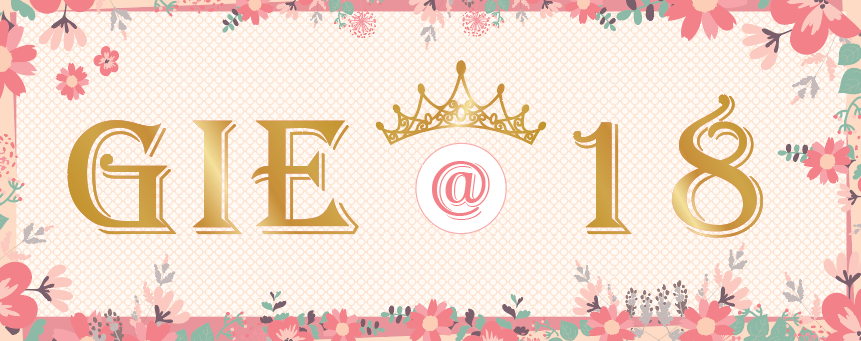
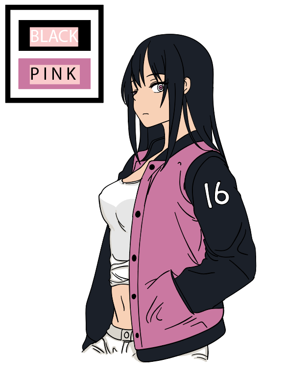
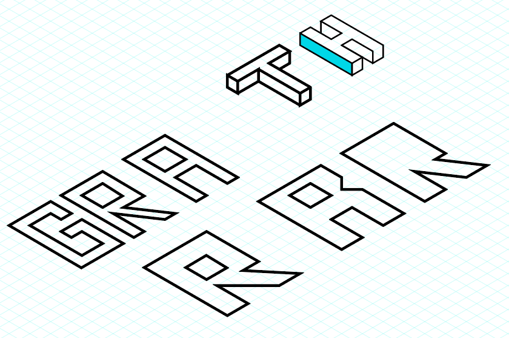
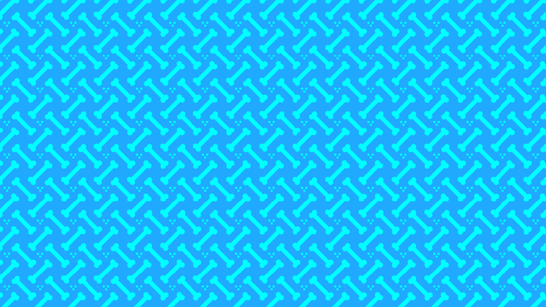
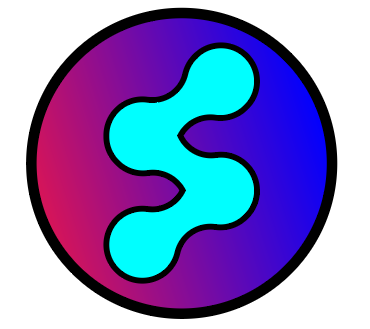
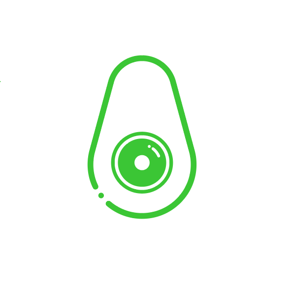

# illustrator
<h1> Regina Banner</h1>

I made this banner for the 18th birthday of my younger sister, using adobe illustrator.

 
 

<h1>May</h1>

I made this digital art using a Wacom small tablet and Adobe Illustrator.
This is to build, line art and coloring skills for creating digital art.

 
 

<h1>Geometric Logo</h1>

 
 

<h1>Isometric Grid</h1>

 
 

<h1>Yin Yang Logo</h1>

 
 

<h1>Dog Bone Wallpaper</h1>

 
 

<h1>Meatball Arc Tool</h1>

 
 

<h1>Avocado Eye Logo</h1>

